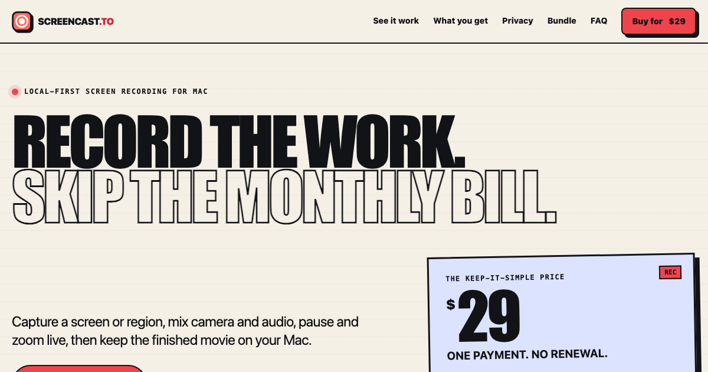

# Screencast.to

A tiny macOS menu-bar screen recorder. Hit record, capture exactly what you
want — pause/resume, live zoom, camera layouts, teleprompter — and keep the
recording local by default. When you choose to upload, Screencast.to creates a
temporary share link that expires after 24 hours. Always free.



## Download

Grab the latest signed and notarized build from **[GitHub Releases](https://github.com/tmoreton/screencast.to/releases/latest/download/screencast.dmg)**.

Requires macOS 15+ (Apple Silicon and Intel).

## Hosting

- **Marketing/privacy site**: static HTML exported from `worker/src/views/*` and deployed to GitHub Pages by `.github/workflows/pages.yml`.
- **Upload/share service**: Cloudflare Worker on `share.screencast.to`, which mints presigned R2 upload URLs and serves temporary viewer pages.
- **Downloads**: GitHub Releases are the canonical public download channel.

## Repo layout

- **`screencast/`** — the Xcode project for the Mac app (menu-bar UI, screen
  recording engine, upload client).
- **`worker/`** — the Cloudflare Worker and shared HTML views. The Worker backs
  upload signing and share playback; the same views export the static GitHub
  Pages site. See [`worker/README.md`](worker/README.md) for setup and deploy
  instructions.
- **`worker/scripts/export-static-site.ts`** — exports the marketing and
  privacy pages for GitHub Pages.
- **`scripts/release.sh`** — builds, signs, notarizes, and packages the Mac
  app into a DMG. Maintainer builds can also mirror the DMG to R2 for legacy
  links, but GitHub Releases are canonical.

## Development

Build the app locally without signing:

```sh
xcodebuild \
  -project screencast.xcodeproj \
  -scheme screencast \
  -configuration Debug \
  -destination 'platform=macOS' \
  CODE_SIGNING_ALLOWED=NO \
  build
```

Public/dev builds compile with upload sharing disabled. Official builds inject
the upload secret and `UPLOAD_WORKER_ENDPOINT=https://share.screencast.to/sign`
through `scripts/release.sh`.

Check the Worker and static site export:

```sh
cd worker
npm ci
npm run check
npm run build:site
```

For the canonical GitHub Pages deployment, the workflow sets
`SITE_CNAME=screencast.to` so the generated artifact includes a `CNAME` file.
Local exports omit that file unless you set `SITE_CNAME` yourself.

## Releasing a new build

```sh
scripts/release.sh              # reads MARKETING_VERSION from the Xcode project
scripts/release.sh 2.1          # or pass a version explicitly
```

This produces a notarized `build/screencast-<version>.dmg` when Apple
Developer ID credentials are configured in `scripts/.env`. To publish or
replace the GitHub release assets:

```sh
ditto build/screencast-<version>.dmg /tmp/screencast.dmg
gh release create v<version> /tmp/screencast.dmg build/screencast-<version>.dmg \
  --title "Screencast.to v<version>" \
  --notes "..."

# For an existing release:
gh release upload v<version> /tmp/screencast.dmg build/screencast-<version>.dmg --clobber
```

## License

Screencast.to is released under the Apache License 2.0. See [LICENSE](LICENSE).
